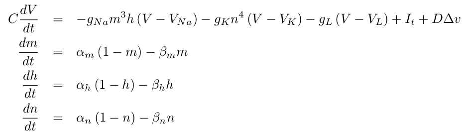
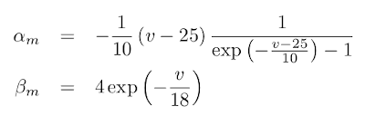
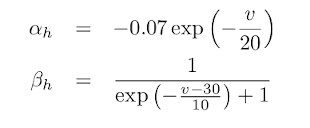
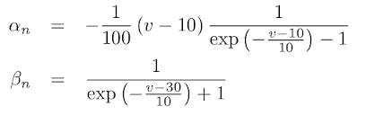

# Hodgkin-Huxley lattice model in *Python* and *julia*

This repo contains implementations of the Hodgkin-Huxley model of cellular excitability on a 2D lattice.  
The code is available in Python and Julia.  

**Ref.:** Hodgkin, A.L., Huxley, A.F., A quantitative description of membrane current and its application to conduction and excitation in nerve. __*J Physiol*__ 117:500-544, 1952.

**Rendered page:** https://frederic-vw.github.io/hodgkin-huxley-2d/

**_Python_ Requirements:**
1. [python](https://www.python.org/) installation, latest version tested 3.6.9
2. python packages (`pip install package-name`)
  - NumPy
  - Matplotlib
  - opencv-python (save data as movie)

**_Julia_ Requirements:**
1. [julia](https://julialang.org/) installation, latest version tested 1.6.1
2. julia packages (`julia > using Pkg; Pkg.add("Package Name")`)
  - NPZ
  - PyCall (load Matplotlib animation functionality)
  - PyPlot
  - Statistics
  - VideoIO (save data as movie)

## Hodgkin-Huxley model

The Hodgkin-Huxley model uses four variables to model the nerve membrane potential and its response to input currents, including action potentials. The four variables represent voltage ($V$), Na+-channel activation ($m$), Na+-channel inactivation ($h$), and K+-channel activation ($n$). 
Spatial coupling is introduced via diffusion of the voltage-like variable:

and the steady-state functions

<!--
Noise is added via Itô-integration:

-->

<!--
$$ 
\frac{dv}{dt} = \frac{1}{c} \left( v - \frac{1}{3}v^3 + w + I_t \right) + D \nabla v \\
\frac{dw}{dt} = c \left( v - a w + b \right) \\
$$
-->

The main function call running the simulation is: `hh2d(N, T, t0, dt, s, D, C, gNa, gK, gL, VNa, VK, VL, I0, stim, blocks)`:  
- `N`: lattice size `(N,N)`
- `T`: number of simulation time steps
- `t0`: number of 'warm-up' iterations
- `dt`: integration time step
- `s`: noise intensity (&sigma;)
- `D`: diffusion constant
- `gNa,gK,gL,VNa,VK,VL`: Hodgkin-Huxley model parameters, `I`: stimulation current amplitude
- `stim`: stimulation current parameters, array of time-, x-, and y-interval borders
- `blocks`: conduction blocks, array of x- and y-interval borders

**Outputs:** `(T,N,N)` array as NumPy .npy format and as .mp4 movie.

In example 1, use
- `stim = [ [[50,350], [1,5], [1,5]], [[1900,2200], [25,30], [1,15]] ]`
- `blocks = [ [[1,15], [5,10]] ]`

### Example-1
Stimulation in the lower left corner generates a travelling wave which breaks at and merges after the conduction blocks. 
After-depolarization does not change the qualitative behaviour of a travelling wave.
Parameters:  
`N = 128, T = 10000, t0 = 2000, dt = 0.01, s = 1.0, D = 1, C = 1, gNa = 120, gK = 36, gL = 0.3, VNa = 115, VK = -12, VL = 10.6, I = 45.0`

<video src="videos/hh2d_I_45.00_s_1.00_D_1.00.webm" width="256" height="256" controls preload></video>

### Conclusions
The Hodgkin-Huxley lattice can produce travelling waves and stimulation-induced spiral waves.
